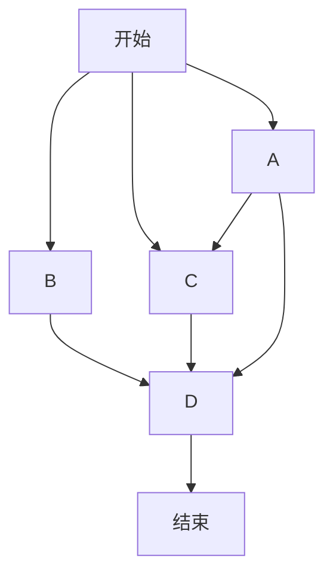

## **基本的带快捷键的 Markdown 书写演示**

`command 1 到 command 6：`普通文本，一级～四级标题；

`command B：`加粗，**加粗测试；**

`command I：`斜体，*斜体测试；*

`command U：`下划线，<u>下划线测试；</u>

`control shift `：`删除线，~~删除线测试；~~

`control ：`代码，`代码测试；` 

`command K：`超链接，[超链接测试](www.baidu.com)

`option command T：`表格

|   标题   | 数据一 | 数据二 |
| :------: | :----: | :----: |
| 表格测试 |  942   |  baka  |

`option command Q：`引用

> 引用测试；

`control command I：`插入图片


`option command B：`数学公式
$$
\int_a^b f(x)\mathrm{d}x
$$

## **基本的不带快捷键 markdown 书写演示**

**部分功能需要在配置文件中开始才能使用**

代码块：三个反引号

```python
#!/usr/bin/python3
import os
with open('list.txt','w') as f:
    for i in range(10):
        f.writelines(str(i))
    print('成功写入数列')
os.system('rm ./list.txt')
print('成功删除文件')
```

无序列表：一个短横，-

- 酒石酸菌
- 硝酸甘油酯

有序列表：数字加点 .

1. python
2. java
3. golang

任务列表：option command X

- [ ]  买菜

- [x]  看书

引用：[^]，里面加上引用数字，后面跟冒号，引用内容

​	通过培养实验研究了有机酸对铅、镉的毒害影响，结果表明柠檬酸对铅[^1]

[^1]:陈苏。污染土壤中镉、铅的活化及植物有效性研究[D]，中国科学院沈阳应用生态研究所。2007。

上标下标

```
上标：X2^2
下标:H~2~O
```

X^2^

H~2~O

高亮

```
本节课重点：==第六、七章补考==，第三章出题较多，==平时分占 30%==
```

本节课重点：==第六、七章补考==，第三章出题较多，==平时分占 30%==

注释：control -

<!--这是一段注释-->

分割线 ---

---

emoji，冒号，后面输入emoji名字

:kissing_smiling_eyes:

目录生成：[toc]

[TOC]

LaTex公式，包括mhchem，AMSmath，BBox：

- mhchem：

$$
\ce{SO4^2- +Ba^2+ -> BaSO4 v}
$$

- Box:

$$
\bbox[5px,border:2px solid red]{AB^2 + AC^2 = BC^2}
$$

流程图

- flow

```flow
st=>start: Start:>http://www.google.com[blank]
e=>end:>http://www.google.com
op1=>operation: My Operation
sub1=>subroutine: My Subroutine
cond=>condition: Yes
or No?:>http://www.google.com
io=>inputoutput: catch somethins...

st->op1->cond
cond(yes)->io->e
cond(no)->sub1(right)->op1
```

- mermaid



- Sequence

```sequence
Alice->>John: Hello John, how are you?
Note right of John: Rational thoughs
John-->>Alice: Great!
John->>Bob: How are you?
Bob-->>John: Jolly good!
```


