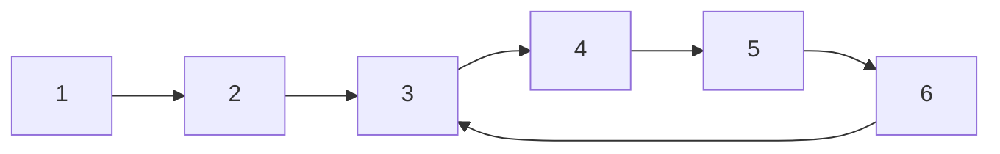

#### **题目描述**

> 给一个链表，若其中包含环，请找出该链表的环的入口节点，否则，输出null。

#### **题目思路**

复杂的链表问题，通常用两个指针来解决。本题首先需要考虑的是判断一个链表是否有环，如下列链表



p1定义一个指针pSlow，在节点2定义一个指针pFast，然后同时开始移动指针，pSlow一次移动一个节点，pFast一次移动两个节点，如果存在环链表，那么pFast肯定会追上pSlow，此时返回pFast的位置，否则返回null

分析完链表存在环后，我们需要找到环的入口，同样定义两个指针PNode1和pNode2，将pNode1移动k个节点，k为环的节点个数，可通过遍历一圈pFast得到，然后同时遍历pNode1和pNode2，当它们相遇时，相遇的地方就是入口点。

#### 题目代码

```java
public class Solution {
    public ListNode MeetingNode(ListNode pHead) {  // 判断是否是环，并返回pFast
        if (pHead == null) return null;
        ListNode pSlow = pHead;
        ListNode pFast = pSlow.next;
        while(pFast!=null && pSlow!=null) {
            if (pFast == pSlow) return pFast;
            pSlow = pSlow.next;
            pFast = pFast.next;
            if (pFast!=null)
                pFast = pFast.next;
        }
        return null;
    }

    public ListNode EntryNodeOfLoop(ListNode pHead) {
        ListNode pFast = MeetingNode(pHead);
        if (pFast == null) return null;
        int loopNumber = 1;
        ListNode pNode1 = pFast;
        while(pNode1.next != pFast) {
            pNode1 = pNode1.next;
            loopNumber++;
        }
        pNode1 = pHead;  // 计算完节点数量后，重制pNode1的位置
        for (int i=0;i<loopNumber;i++) pNode1 = pNode1.next;
        ListNode pNode2 = pHead;
        while(pNode2 != pNode1) {
            pNode1 = pNode1.next;
            pNode2 = pNode2.next;
        }
        return pNode1;
    }
}
```

